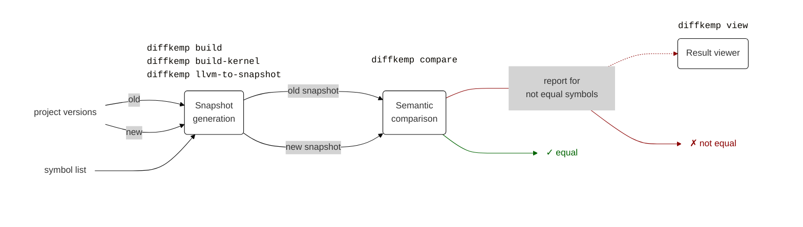

# DiffKemp

DiffKemp is a framework for automatic static analysis of semantic differences
between different versions of projects written in C, with main focus on the
Linux kernel.

The main use-case of DiffKemp is to compare selected functions and configuration
options in two versions of a project and to report any discovered semantic
differences.

> [!WARNING]
> DiffKemp is incomplete in its nature, hence may provide false positive
results (i.e. claiming that functions are not equivalent even though they are).
This especially happens with complex refactorings.

## Installation

You can install DiffKemp:

- By building it manually [from source](docs/installation.md)
- From a prepared RPM package that can be installed from our
  [Copr repository](https://copr.fedorainfracloud.org/coprs/viktormalik/diffkemp/):

  ```sh
  # Enabling the DiffKemp repository
  dnf install -y dnf-plugins-core
  dnf copr enable -y viktormalik/diffkemp
  # Installing DiffKemp
  dnf install -y diffkemp
  ```

## Usage



DiffKemp runs in three phases:

1. **Snapshot generation** takes symbols (functions) that you want to compare
   and project versions. It compiles the versions into LLVM IR
   (which it uses for the comparison) and creates
   so-called *snapshots* which contain the relevant LLVM IR files and
   additional metadata. (DiffKemp needs the analysed project to be compiled with
   debugging information in order to work properly.)

   There are several options for snapshot generation:
     - ```sh
       diffkemp build PROJ_DIR SNAPSHOT_DIR [SYMBOL_LIST]
       ```
       is the default snapshot generation command for `make`-based projects.
     - ```sh
       diffkemp build-kernel KERNEL_DIR SNAPSHOT_DIR SYMBOL_LIST
       ```
       is a command specialized for building snapshots from the Linux kernel.
     - ```sh
       diffkemp llvm-to-snapshot PROJ_DIR LLVM_FILE SNAPSHOT_DIR SYMBOL_LIST
       ```
       can be used if the project is already compiled into a single LLVM IR file.

   In any case, the command should be run twice, once for each of the compared
   versions.

2. **Semantic comparison** takes two snapshots, compares them for semantic
   equality, and saves a report about symbols that were compared as semantically
   different. It is invoked via:

    ```sh
    diffkemp compare SNAPSHOT_DIR_1 SNAPSHOT_DIR_2 -o COMPARE_OUTPUT_DIR
    ```

3. Additionally, you can run **result viewer** to get a visualisation of
   the found differences:

   ```sh
   diffkemp view COMPARE_OUTPUT_DIR
   ```

See the [Usage reference](docs/usage.md) to learn more about how to use
individual commands.

## Examples

If you want to learn how you can use DiffKemp, you can read the following
examples:

- [Simple program](docs/examples/simple_program.md): Example of using DiffKemp
  on a very simple program (contains a few lines of code) to understand how to
  use DiffKemp, what it does, and what it gives us as a result.

## How does it work?

The main focus of DiffKemp is high scalability, such that it can be applied to
large-scale projects containing a lot of code. To achieve that, the analysed
functions are first compiled into LLVM IR, then several code transformations are
applied, and finally the comparison itself is performed.

Wherever possible, DiffKemp tries to compare instruction-by-instruction (at the
level of LLVM IR) which is typically sufficient for most of the code. When not
sufficient, DiffKemp tries to apply one of the built-in or user-supplied
*semantics-preserving patterns*. If no pattern can be applied,
the relevant diffs are reported to the user.

## Development

- [Development guide](docs/development.md)

## Contributors

The list of code and non-code contributors to this project, in pseudo-random
order:
- Viktor Malík
- Tomáš Glozar
- Tomáš Vojnar
- Petr Šilling
- Pavol Žáčik
- Lukáš Petr
- Tatiana Malecová
- Jakub Rozek

## Publications and talks

There is a number of publications and talks related to DiffKemp:

- ICST'21 [paper](https://ieeexplore.ieee.org/document/9438578)
  and [talk](https://zenodo.org/record/4658966):  
  V. Malík and T. Vojnar, "Automatically Checking Semantic Equivalence between
  Versions of Large-Scale C Projects," 2021 14th IEEE Conference on Software
  Testing, Verification and Validation (ICST), 2021, pp. 329-339.
- [DevConf.CZ'19 talk](https://www.youtube.com/watch?v=PUZSaLf9exg).
- NETYS'22
  [paper](https://link.springer.com/chapter/10.1007/978-3-031-17436-0_18) and
  [talk](https://www.youtube.com/watch?v=FPOUfgorF8s):  
  Malík, V., Šilling, P., Vojnar, T. (2022). Applying Custom Patterns in
  Semantic Equality Analysis. In: Koulali, MA., Mezini, M. (eds) Networked
  Systems. NETYS 2022.
