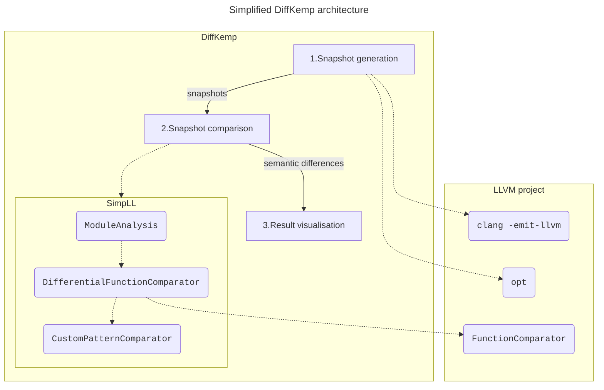
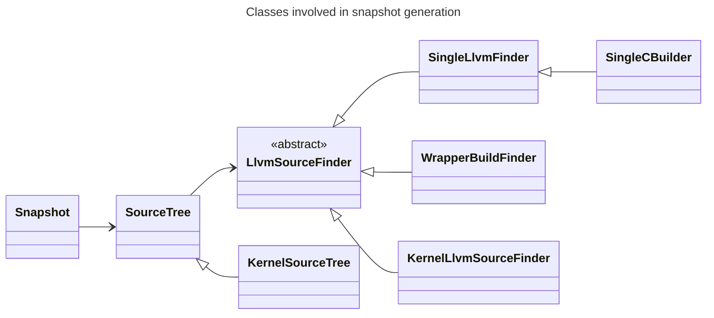
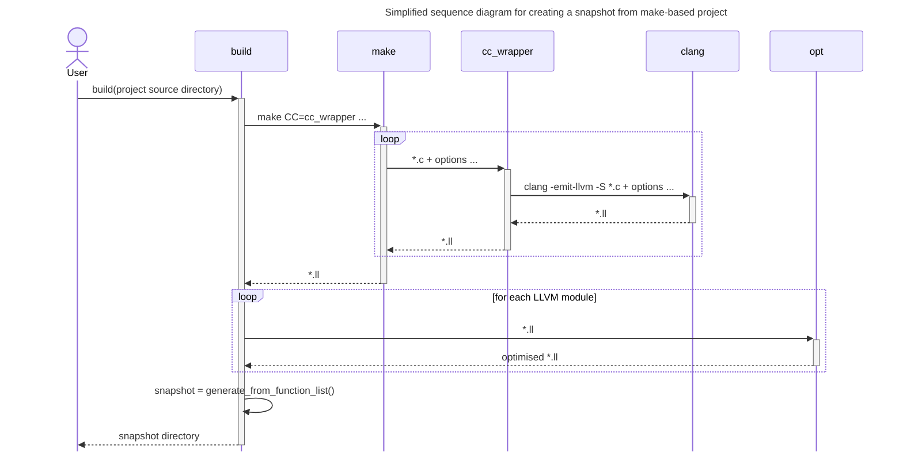
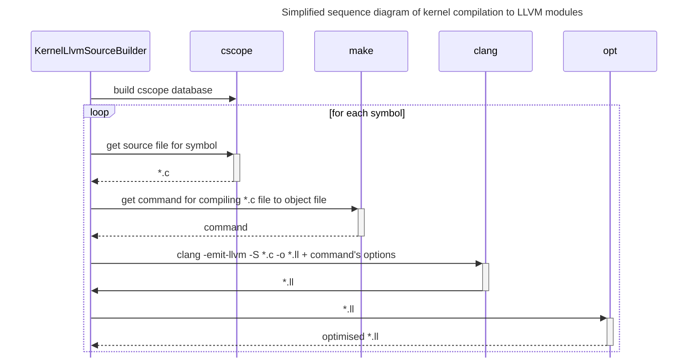
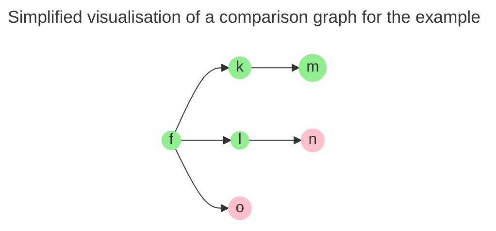
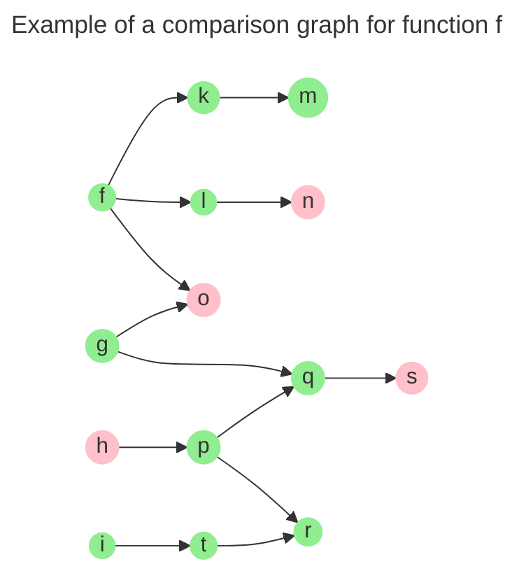
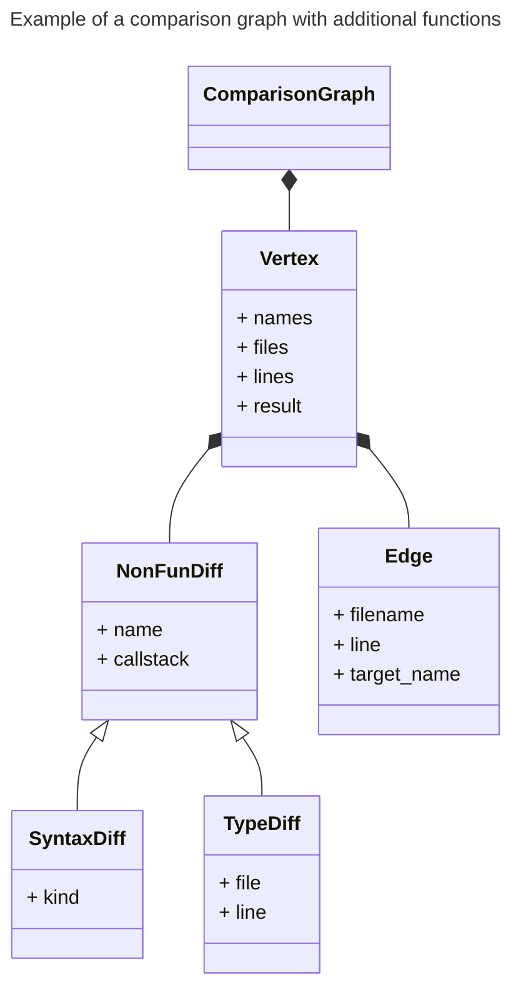
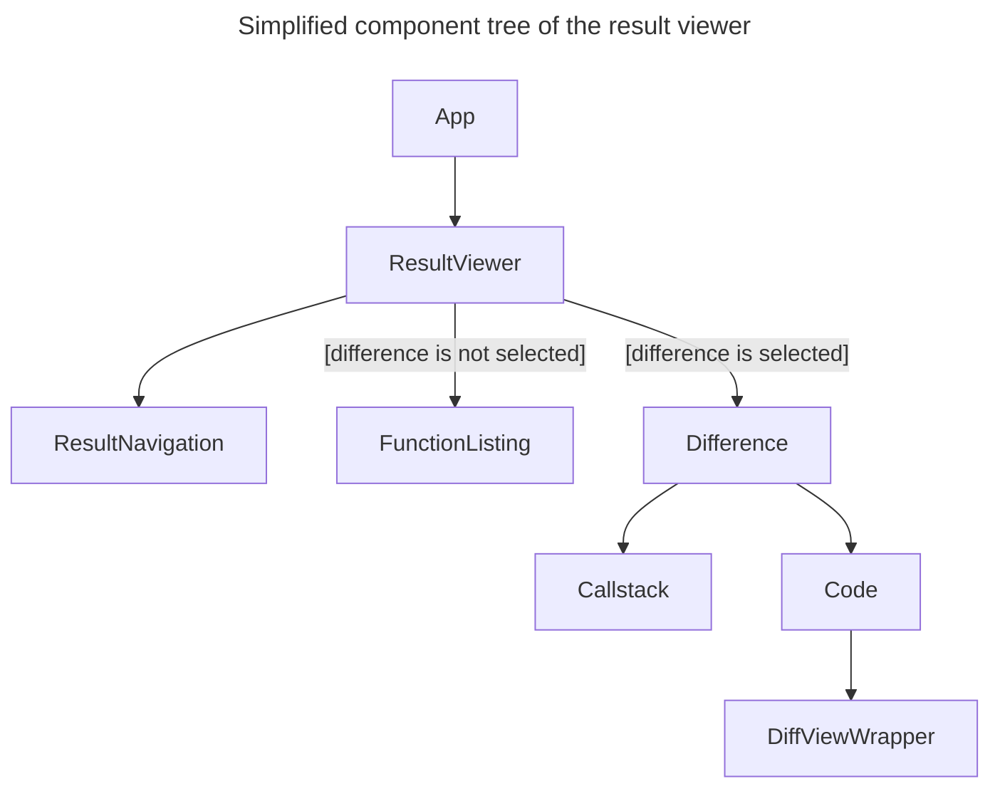

# DiffKemp architecture



DiffKemp consists of several components:
- **Python component** (located in the `diffkemp/` directory): Responsible for
  the processing of user inputs, compiling projects into snapshots, aggregating
  results of semantic comparison, and generating reports.
- **SimpLL library** (located in the `diffkemp/simpll/` directory): The core of
  DiffKemp, written in C++ for performance reasons. It simplifies and
  semantically compares two versions of the project symbols.
- **Result viewer** (located in the `view/` directory): A web application,
  written in React and JavaScript, used to visualise the differences found
  during the comparison.

DiffKemp uses  [`CMake`](https://cmake.org/) as its build system and relies on
the [LLVM project](https://llvm.org/). Specifically, it uses
[LLVM intermediate representation](https://llvm.org/docs/LangRef.html) for
representing and comparing different versions of the analysed projects.

## Phases of DiffKemp

DiffKemp runs in phases, in which the different parts of DiffKemp play their
roles:
1. [**Snapshot generation**](#1-snapshot-generation):
   - The source code of the analysed project is compiled into LLVM IR using
     the [`clang`](https://clang.llvm.org/docs/ClangCommandLineReference.html)
     compiler.
   - After compilation, optimisation passes are run (using
     [`opt`](https://llvm.org/docs/CommandGuide/opt.html)) to simplify the LLVM
     IR.
   - The compiled project is saved to a directory, which we call a **snapshot**.
2. [**Snapshot comparison**](#2-snapshot-comparison):
   - Two snapshots (corresponding to different versions of the analysed project)
     are compared using the SimpLL library.
   - For each snapshot, the library simplifies (by applying multiple code
     transformations) and analyses the LLVM modules in which are located
     definitions of the analysed symbols. This is done using the
     `ModuleAnalysis` class.
   - The core comparison is handled by the `DifferentialFunctionComparator`
     class, which extends LLVM's [`FunctionComparator`](https://llvm.org/doxygen/classllvm_1_1FunctionComparator.html)
     class. The `FunctionComparator` class handles instruction-by-instruction
     comparison. DiffKemp extends this functionality by handling
     semantics-preserving changes (implemented as **built-in patterns**),
     allowing it to manage more complex changes/refactorings.
   - Additional **(custom) patterns** can be specified manually and passed to
     the comparison phase. These patterns are used if both the
     instruction-by-instruction comparison and the built-in patterns fail to
     detect semantic equality. In such cases, the `DifferentialFunctionComparator`
     uses the `CustomPatternComparator` class to attempt to match the changes
     against the provided patterns.
   - The results of the comparison of individual symbols are aggregated, and
     the found differences are reported to the user.
3. [**Result visualisation**](#3-result-visualisation):
   - The result viewer enables the user to interactively explore the found
     differences (the analysed symbols that were evaluated as semantically
     non-equal). It shows the relation between the analysed symbols and the
     location causing the semantic non-equality, allowing the user to display
     the source code of the analysed project versions with highlighted syntactic
     differences that are likely causing the semantic non-equality.

## 1. Snapshot generation

The snapshot generation phase consists of the following steps:

1. **Identifying relevant source files**:
   - Determine which parts of the project's code need to be compared. This
     typically means finding source files that contain definitions of the
     compared symbols specified by the user.
2. **Compiling source files to LLVM IR**:
   - The identified source files are compiled into LLVM modules containing
     human-readable LLVM IR using the `clang` compiler with the command
     `clang -S -emit-llvm ...`.
   - To make the oncoming comparison easier, [several optimisation passes](https://github.com/diffkemp/diffkemp/blob/master/diffkemp/llvm_ir/optimiser.py)
     (`dce` - dead code elimination, `simplifycfg` - simplifying control flow
     graph, ...) are run on the compiled LLVM modules. The passes are run using
     the `opt` utility.
3. **Creating and saving a snapshot**:
   - A snapshot, representing one version of the program prepared for
     comparison, is created from the compiled files and saved in the specified
     directory.



Classes involved in snapshot generation:
- [`LlvmSourceFinder`](https://github.com/diffkemp/diffkemp/blob/master/diffkemp/llvm_ir/llvm_source_finder.py):
  - An abstract class with a concrete implementation based on the command used
    for snapshot generation.
  - It is responsible for finding LLVM modules containing specific symbol. For
    some commands, it also handles finding necessary project source files and
    their compilation to LLVM IR.
- [`SourceTree`](https://github.com/diffkemp/diffkemp/blob/master/diffkemp/llvm_ir/source_tree.py):
  - Represents the source tree of analysed project.
  - This class wraps the `LlvmSourceFinder` class and provides its functionality.
  - The derived class, [`KernelSourceTree`](https://github.com/diffkemp/diffkemp/blob/master/diffkemp/llvm_ir/kernel_source_tree.py),
    extends its functionality by enabling to retrieve modules containing
    definitions of sysctl options and kernel modules.
- [`Snapshot`](https://github.com/diffkemp/diffkemp/blob/master/diffkemp/snapshot.py)
  - Represents the snapshot, which contains:
    - Relevant source files, including those containing definitions of the
      compared symbols.
    - The source files compiled into LLVM IR, which are used for the actual
      comparison.
    - Metadata, saved in the snapshot directory as a `snapshot.yaml` file with
      the following structure:
      ```yaml
      # For more details, refer to the implementation
      - created_time: Date and time of snapshot creation (YYYY-MM-DD hh:mm:ss.sTZ)
        diffkemp_version: x.y.z
        list: # List of compared symbols (functions or sysctl options) and their metadata
        # In cases of function comparison, contains directly the list from the `functions` field`.
        - functions:                                                           
          - glob_var: null # Name of the global variable whose usage is analysed within the function (only for sysctl).
            name: Name of function
            llvm: Relative path to module containing the function
            tag: null # Only for sysctl, describes if the function is proc handler or uses the sysctl data variable
          # Only for sysctl
          sysctl: Sysctl option name
        list_kind: Type of comparison (function/sysctl)
        llvm_source_finder:
          kind: Used LlvmSourceFinder class
        llvm_version: XX
        source_dir: Absolute path to the project's source directory
      ```

### a) Snapshot generation of `make`-based projects (`build`)

The `build` command is used to create snapshots from `make`-based projects.
The process includes the following steps:

1. The `make` command is executed on the project with [`cc_wrapper`](#cc-wrapper)
   used as the compiler instead of a standard compiler like `gcc`.
2. By running `make`, the project's source files are compiled to LLVM modules by
   the `cc_wrapper` script.
3. After `make` completes the compilation, the resulting LLVM modules are
   optimised using `opt` tool.
4. The `WrapperBuildFinder` class is used to identify the LLVM modules
   containing definitions of symbols specified by the user.
5. A snapshot is generated from the identified LLVM modules.



#### `cc_wrapper`

The [`cc_wrapper`](https://github.com/diffkemp/diffkemp/blob/master/diffkemp/building/cc_wrapper.py)
is a Python script that wraps the `gcc` compiler. If [RPython](https://rpython.readthedocs.io/en/latest/)
is installed on the user's system, the `cc_wrapper` is compiled into a binary
form during DiffKemp's build process using RPython. This binary form speeds up
the snapshot generation process.

The `cc_wrapper` operates as follows:
- The `cc_wrapper` is invoked by `make` receiving the source file and options
  which would be used for compilation.
- The wrapper executes the original command using `gcc`, and additionally it
  compiles the C source file into LLVM module using `clang` and the received
  options.
- The user can optionally specify options to be added or removed when compiling
  the file to an LLVM module. These options are passed from the main DiffKemp
  script to the wrapper via system environment variables (the variables are
  prefixed with `DIFFKEMP_WRAPPER_`).
- The paths to the generated LLVM modules, along with flags indicating how they
  were created, are recorded in a file named `diffkemp-wdb`. The `f` flag
  indicates that the module was created by linking already compiled LLVM
  modules. The file format looks like this:
  ```
  o:/abs/path/to/module.ll
  f:/abs/path/to/linked_module.ll
  ...
  ```
  The `diffkemp-wdb` file is later used by the `WrapperBuildFinder` to locate
  modules containing the specified functions, which are then included in the
  final snapshot.

### aa) Snapshot generation of single C file (`build`)

The `build` command can also be used to create snapshots from a single C file.
It uses the [`SingleCBuilder`](https://github.com/diffkemp/diffkemp/blob/master/diffkemp/llvm_ir/single_c_builder.py)
class as the `LlvmSourceFinder`. The class also manages the compilation of the
C file into an LLVM module.

### b) Snapshot generation from the Linux kernel (`build-kernel`)

The `build-kernel` command is used to create snapshots from the Linux kernel's
source code. It compiles only the necessary files based on the symbols specified
by the user for comparison. The snapshot can be created using a list of
functions or sysctl parameters. The command uses
[`KernelLlvmSourceBuilder`](https://github.com/diffkemp/diffkemp/blob/master/diffkemp/llvm_ir/kernel_llvm_source_builder.py)
class as the `LlvmSourceFinder`. The process includes the following steps:

1. **Building a symbol cross-reference database** for the kernel using the
   [`cscope`](https://cscope.sourceforge.net/) tool. This database is then used
   to locate symbol definitions and usages within the kernel's source code.
2. **Identifying necessary files for the comparison** based on the provided
   symbol list.
   - If a **list of functions** is provided, the C source file containing the
     function definition is located using `cscope` for each function.
   - In case **list of sysctl parameters** is provided, the process is slightly
     different:
     1. The source file containing a sysctl table describing the parameter is
        identified and compiled into LLVM module.
     2. The proc handler function name (responsible for reading/writing the
        parameter value) and data variable (a global variable updated by the
        parameter) are extracted from the sysctl table.
     3. Source files containing the proc handler function and functions that
        interact with the data variable are identified using `cscope`.
3. The identified source **files are compiled into LLVM modules** using the
   following steps for each file:
   - The `make` tool is used to determine the compilation options required for
     the source file.
   - The source file is compiled into an LLVM module using `clang` with the
     discovered options. The module is then optimized using `opt` tool.
4. **A snapshot is created** from the compiled LLVM modules.



### c) Snapshot generation from a single LLVM IR file (`llvm-to-snapshot`)

The `llvm-to-snapshot` command is used to create snapshots from a single
existing LLVM module. It uses the
[`SingleLlvmFinder`](https://github.com/diffkemp/diffkemp/blob/master/diffkemp/llvm_ir/single_llvm_finder.py)
class as the `LlvmSourceFinder`.

## 2. Snapshot comparison

The snapshot comparison phase is invoked using `compare` subcommand. It operates
on two snapshots generated from different versions of the project.

This phase analyses/compares specific functions based on the symbols specified
during the snapshots generation:

- **Standard symbols:** By default, functions specified during snapshot
  generation are analysed. If no symbols were provided, all functions are
  considered. Currently, non-function symbols (e.g., global variables) are not
  analysed.
- **Sysctl parameters:** When sysctl parameters are specified during snapshot
  generation, the tool compares the following for each parameter:
  - the semantics of the proc handler function,
  - all functions that interact with the data variable set by the sysctl
    parameter.
  Functions are compared with respect to the data variable, meaning only the
  portions of the functions influenced by the variable are analysed. Even if a
  function is not semantically equal in its entirety, it may still be considered
  semantically equal with respect to the variable.

The phase includes the following steps:

1. **Simplification and comparison:** Each function is simplified and
   semantically compared using the [SimpLL library](#simpll-library).
2. **Result aggregations and report creation:** The results of individual
   function comparisons are aggregated. If a function is found to be
   semantically non-equal, places where semantic differences were found are
   collected, and report is created.

### Comparison process overview

For each analyzed function, the following steps are performed:

1. **Simplification and comparison:** The function is [simplified and compared](#usage-of-the-simpll-library)
   by the [SimpLL library](#simpll-library), which uses LLVM modules containing
   the analysed function's code. The library produces a [*comparison graph*](#comparison-graph)
   with the results of the analysis.
2. **Graph absorption:** The comparison graph for the currently analysed
   function is absorbed into the graph gained from previously analysed
   functions.
3. **Identification of reachable functions:** All functions reachable from the
   analyzed function are identified in the comparison graph. This includes
   the analyzed function itself and any functions it calls.
4. **Recording non-equal results:** Reachable functions that SimpLL evaluated as
   semantically non-equal are recorded as the analysed function's
   *inner-results*. Additionally, *non-function* differences (semantic
   differences located by the SimpLL library in types, macros or inline
   assemblies) used by these functions are also recorded.
5. **Final result creation:** The final result for the analysed function is
   determined. It is marked as non-equal if any reachable function was evaluated
   as semantically non-equal. The final result also includes the
   *inner-results*.
6. **Reporting**: The final [result](#result-representation), along with details
   about the inner-results, is [reported](#comparison-report) to the user.

During the comparison process, [caching mechanisms](#caching-mechanisms) are
used to speed up the process.

#### Usage of the SimpLL library

The analysis of functions is performed by the [SimpLL library](#simpll-library).
DiffKemp interacts with the library either through its CLI (command line
interface) or via [CFFI](https://cffi.readthedocs.io/en/stable/)
(C Foreign Function Interface for Python).

- **CFFI usage:** By default DiffKemp uses the SimpLL library via CFFI.
  In this case, the library is loaded as a [Python extension module](https://docs.python.org/3/extending/extending.html),
  allowing Python code to directly interact with the SimpLL library. This
  extension module is created by
  a [build script](https://github.com/diffkemp/diffkemp/blob/master/diffkemp/simpll/simpll_build.py).

  The module exposes functions for interacting with the SimpLL library,
  these function are defined in the [`FFI.cpp` file](https://github.com/diffkemp/diffkemp/blob/master/diffkemp/simpll/library/FFI.cpp).

  The CFFI is also used by snapshot generation for identification of necessary
  functions for the sysctl parameters comparison.
- **CLI usage:** If DiffKemp's `compare` subcommand is run with
  `--disable-simpll-ffi` option, DiffKemp interacts with the SimpLL library via
  its CLI. The following command is used:
  ```sh
  diffkemp-simpll OLD_MODULE NEW_MODULE --fun FUNCTION_NAME ENABLED_PATTERNS ...
  ```
  - `OLD_MODULE` refers to the LLVM module containing the old version of the
    analysed function.
  - `NEW_MODULE` refers to the LLVM module containing the new version.
  - `ENABLED_PATTERNS` refers to options for enabling individual built-in
    patterns. DiffKemp enables certain patterns by default.

  The command outputs the comparison graph to standard output.

  The SimpLL library can also be used as a standalone tool (without DiffKemp’s interface) to compare functions directly. However, using it this way is
  generally less convenient than working with DiffKemp. If using SimpLL independently, it is useful to enable the `--verbosity` option to activate
  logging, which is helpful for debugging. Additionally, unlike DiffKemp,
  SimpLL does not enable any built-in patterns by default, so they need to be manually activated to ensure better results.

#### Comparison graph

The *comparison graph* contains call graphs for analysed functions, including
the analyzed functions themselves and functions they call. For each function,
the graph provides basic details like its file location and, most importantly,
the result of its semantic comparison performed by the SimpLL library. The
result is typically *equal* or *non-equal*, though there are also special cases
like *assumed-equal* or *unknown*. The comparison graph can also include
information about *non-function* differences, which refer to differences
detected within types or so called *syntax differences*. Syntax difference
represent difference found in macro, inline assembly or between function and
macro.



The diagram above is a simplified visualisation of the comparison graph that
would be outputted by the SimpLL library for the following example: function
`f` is analyzed function which calls functions `k`, `l`, `o`, `m`, and `n`
(with `m` and `n` called indirectly through `k` and `l`, respectively).
Functions `n` and `o` contain semantic differences. The comparison results are
visualised in the graph by colors, with green representing semantically equal
functions and red indicating non-equal ones.

If we analyse additional functions (`g`, `h` and `i`) with the SimpLL library
and absorb their comparison graphs by the one generated for function `f`, we
would get a more complex comparison graph, as shown below:



The comparison graph produced by the SimpLL library is represented in DiffKemp
by [`ComparisonGraph` class](https://github.com/diffkemp/diffkemp/blob/master/diffkemp/semdiff/caching.py) and other classes located in the same file:

- `ComparisonGraph` represents the overall comparison graph.
- `Vertex` contains details about individual functions, including names, file
  locations, lines where their definitions start, and semantic comparison
  results.
- `Edge` represents the relationships between called functions.
- `NonFunDiff`, `SyntaxDiff` and `TypeDiff` capture non-function differences,
  such as those found in types or macros.



#### Result representation

The total results of the analyzed functions and their inner-results are
represented by the [`Result` class](https://github.com/diffkemp/diffkemp/blob/master/diffkemp/semdiff/result.py). This class aggregates instances of found semantic
differences, each including call stack that show how the location of the
difference relates to the analysed functions.

#### Comparison report

DiffKemp reports the found semantic differences to a user-specified directory.
The directory contains files with the `.diff `extension representing the
analysed functions where differences were found. Each file includes detailed
information about these differences. For sysctl comparison, the `.diff`
files are organized into subdirectories for individual sysctl parameters,
which contain `.diff` files for non-equal functions analysed for that specified
parameter.

Examples of the file format can be seen in the [musl library](https://github.com/diffkemp/diffkemp/blob/master/docs/examples/musl_library.md)
and a [simple program](https://github.com/diffkemp/diffkemp/blob/master/docs/examples/simple_program.md) examples.

The directory also contains `diffkemp-out.yaml` file, which presents information
about the found differences in more structured format:

```yaml
old-snapshot: # Absolute path to the snapshot directory with the old program version
new-snapshot: # Absolute path to the snapshot directory with the new program version
results: # List of functions compared as semantically non-equal
- function: # Name of the analysed function
  diffs: # List of found differences
  - function: # Name of differing symbol (function/macro/type)
    old-callstack: # Call stack for the old program version
    - name: ... # Name of called/used symbol (function/type/macro)
      file: ... # Relative path to a file in which the symbol is called/used
      line: ... # Line on which the symbol is called/used
    - # ...
    new-callstack: # Call stack for the new program version
    - # ...
  - # ...
- # ...
definitions: # Dictionary with definition locations for previously mentioned symbols
  <name>: # Name of symbol
    kind: # Kind of symbol (function/type/macro)
    old: # Information about definition location in the old program version
      file: # Relative path to the file containing the symbol definition
      line: # Line number where the symbol definition starts
      end-line: # Line number where the symbol definition ends
    new: # Information about definition location in the new program version
      file: # ...
      line: # ...
      end-line: # ...
  # ...
```

Note: Currently, the output does not contain definition locations for macros.

#### Caching mechanisms

- **Caching names of already analysed functions**: By default, when DiffKemp
  runs the SimpLL library, it caches the names of functions that have already
  been analysed. This prevents repeated analysis of functions analysed in
  previous library runs. If the library encounters a call to a cached function,
  it marks the result of the function as *unknown*. When absorbing the
  comparison graph outputted by the library, the *unknown* result is ignored,
  and the original result of the cached function is retained. The caching is
  implemented in DiffKemp by [`SimpLLCache` class](https://github.com/diffkemp/diffkemp/blob/master/diffkemp/semdiff/caching.py)
  and in SimpLL by the [`ResultsCache` class](https://github.com/diffkemp/diffkemp/blob/master/diffkemp/simpll/ResultsCache.cpp).
- **Caching parsed LLVM IR for frequently used modules**: By default, every run
  of SimpLL parses and loads LLVM IR modules containing the code of the analysed
  functions into memory. Since many analyzed functions may be located in
  a single module, DiffKemp’s `compare` sub-command offers the
  `--enable-module-cache` option to avoid unnecessary repeated parsing,
  which can slow down the comparison. Note that this caching mechanism only
  works when the SimpLL library is used through CFFI (i.e., when the `--disable-simpll-ffi` option is not used). In this case, frequently used
  modules are parsed only once and kept in memory as LLVM’s object structure,
  with pointers to it wrapped in the Python [`SimpLLModule`](https://github.com/diffkemp/diffkemp/blob/master/diffkemp/simpll/library.py)
  class. The cached parsed module is then passed to SimpLL instead of being
  re-parsed. Since SimpLL performs destructive transformations on the code, it
  is necessary to provide copy of the cached parsed module, ensuring the
  original remains untouched. A `fork` call is to implement a copy-on-write
  mechanism for the cached modules.

### SimpLL library

WIP

## 3. Result visualisation

The result visualisation phase is invoked via `view` subcommand and consists of
the following steps:

1. Preparation for visualisation:
   - Syntactic differences of the analysed functions are created. The result
     viewer later uses them.
   - Project source files and the differences are copied to a directory
     accessible by the result viewer application.
2. Execution of [the result viewer](#result-viewer):
   - A result viewer is a web application accessible at
     <http://localhost:3000/>. It enables users to browse and view information
     about the found semantic differences.

### Result viewer

The result viewer is a client-side web application developed in JavaScript using
the [React](https://react.dev/) framework and bootstrapped with
[Create React App](https://create-react-app.dev/). The application runs locally
on the user's computer using a Python HTTP server.

The application loads a file describing the results of the project's comparison
(`diffkemp-out.yaml`) and displays a list of the compared symbols evaluated to
contain semantic differences. Upon selecting a specific symbol, the application
lists places (functions, types, macros) in which semantic differences were
located. For a selected place (difference), it shows:

- Call stack containing symbols leading from the compared symbol to the symbol
  where the semantic difference was located. The call stack is interactive,
  allowing users to select a symbol. By default, the symbol with the semantic
  differences is selected.
- Source code view displaying the selected symbol's definition in both versions
  of the project source code. If the selected symbol is where the semantic
  difference was located, the syntax differences are highlighted. For other
  symbols, the usage location of the next symbol from the call stack is
  highlighted.

The application implementation is located in `/view/` subdirectory. The main
components of the application are:

- [`ResultViewer`](https://github.com/diffkemp/diffkemp/blob/master/view/src/components/ResultViewer.jsx):
  The main component that loads the comparison results and represents them using
  the [Result](https://github.com/diffkemp/diffkemp/blob/master/view/src/Result.js)
  class. It renders components for selecting functions or a visualising the
  selected difference.
- [`ResultNavigation`](https://github.com/diffkemp/diffkemp/blob/master/view/src/components/ResultNavigation.jsx):
  Informs the user about the currently shown difference and allows navigation
  between found differences.
- [`FunctionListing`](https://github.com/diffkemp/diffkemp/blob/master/view/src/components/FunctionListing.jsx):
  Rendered when no specific place with semantic difference is selected. It lists
  the compared symbols (functions) evaluated as semantically different or
  symbols/places where semantic difference were located for a selected compared
  symbol.
- [`Difference`](https://github.com/diffkemp/diffkemp/blob/master/view/src/components/Difference.jsx):
  Rendered when a difference is selected. It manages the rendering of the
  `Callstack` and `Code` components.
- [`Callstack`](https://github.com/diffkemp/diffkemp/blob/master/view/src/components/Callstack.jsx):
  Renders the call stack for the selected difference, allowing users to select a
  symbol from the call stack, which updates the displayed source code in the
  `Code` component.
- [`Code`](https://github.com/diffkemp/diffkemp/blob/master/view/src/components/Code.jsx):
  Fetches the files necessary for code visualisation. This includes source files
  with the selected symbol's definition and a diff file with syntax differences
  between versions of the symbol's definitions.
- [`DiffViewWrapper`](https://github.com/diffkemp/diffkemp/blob/master/view/src/components/DiffViewWrapper.jsx):
  Displays the source code from both project versions containing the definition
  of the selected symbol. It uses the [react-diff-view](https://github.com/otakustay/react-diff-view)
  package.


