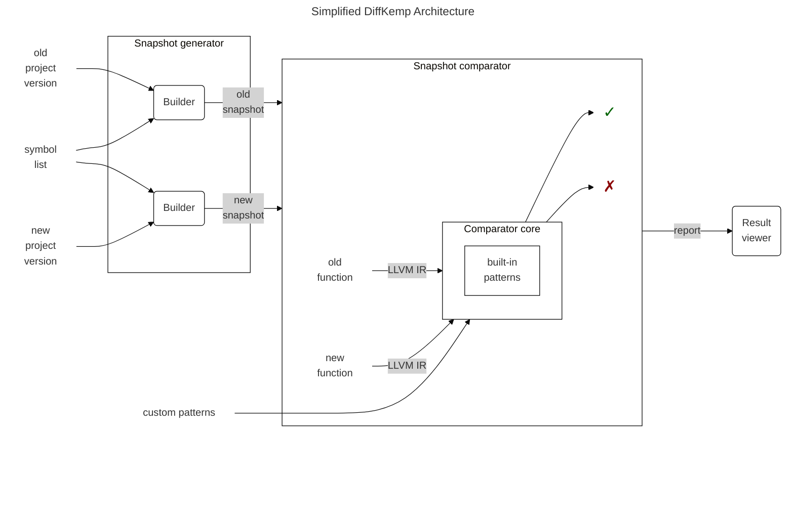

# DiffKemp Architecture

> [!NOTE]
> By **symbols** are currently meant either:
>
> - functions or
> - [kernel *sysctl options*](https://docs.redhat.com/en/documentation/red_hat_enterprise_linux/8/html/managing_monitoring_and_updating_the_kernel/configuring-kernel-parameters-at-runtime_managing-monitoring-and-updating-the-kernel)

## Phases of DiffKemp

DiffKemp runs in phases, in which the different parts of DiffKemp play their
roles:

<!-- TODO create file describing generation in more detail, add link -->
1. **Snapshot generation**:
   - The source code of the analyzed project is compiled into [LLVM IR](https://llvm.org/docs/LangRef.html)
     using the [`clang`](https://clang.llvm.org/docs/ClangCommandLineReference.html)
     compiler.
   - After compilation, optimization passes are run (using [`opt`](https://llvm.org/docs/CommandGuide/opt.html))
     to simplify the LLVM IR.
   - The compiled project is saved to a directory, which we call a **snapshot**.
<!-- TODO create file describing comparison in more detail, add link -->
2. **Snapshot comparison**:
   - Two snapshots (corresponding to different versions of the analyzed project)
     are then compared by the *snapshot comparator*.
     <!-- TODO after docs for custom change patterns exist add a link here -->
   - Optionally, it is possible to provide *custom change patterns* (CCPs) to
     the comparator. This enables the comparator to ignore specific non-semantic
     preserving changes such as bug fixes and security issues which are often
     project specific.
   - The comparator further simplifies (by applying multiple code
     transformations) the LLVM IR and analyses it.
   - Simply said, DiffKemp detects functions from the project which are
     needed to be compared, finds the same function in the old version of the
     project and in the new, and by using its LLVM IR representation it compares
     them.
   <!-- TODO create docs listing semantic preserving patterns with its description -->
   <!-- and add link here-->
   - The comparison is done *instruction-by-instruction* and enhanced by
     handling some of *semantics-preserving change patterns* (SPCPs) which are
     built-in into the comparator, allowing it to manage more complex
     changes/refactorings. If both
     - the *instruction-by-instruction* comparison and
     - the *built-in* patterns

     fail to detect semantic equality, the *custom change patterns* are used and
     the comparator attempts to match the code changes against the provided
     patterns (if they are provided).
   - The functions are evaluated as semantically equal if all parts of function
     are matched between versions by using the above mentioned methods, in other
     case, the functions are evaluated as semantically non-equal.
   - Finally, the results of the comparison of individual symbols are
     aggregated, and the found differences are reported to the user.
<!-- TODO create file describing comparison in more detail, add link -->
3. **Result visualization**:
   - The result viewer enables the user to interactively explore the found
     differences (the analyzed symbols that were evaluated as semantically
     non-equal). It shows the relation between the analyzed symbols and the
     location causing the semantic non-equality, allowing the user to display
     the source code of the analyzed project versions with highlighted syntactic
     differences that are likely causing the semantic non-equality.

## Technical overview

DiffKemp consists of several components:

- **Python component** (located in the `diffkemp/` directory): Responsible for
  the processing of user inputs, compiling projects into snapshots, aggregating
  results of semantic comparison, and generating reports.
- **SimpLL library** (located in the `diffkemp/simpll/` directory): The core of
  DiffKemp, written in C++ for performance reasons. It simplifies and
  semantically compares two versions of the project symbols.
- **Result viewer** (located in the `view/` directory): A web application,
  written in React and JavaScript, used to visualize the differences found
  during the comparison.

DiffKemp uses  [`CMake`](https://cmake.org/) as its build system and relies on
the [LLVM project](https://llvm.org/). Specifically, it uses
[LLVM intermediate representation](https://llvm.org/docs/LangRef.html) for
representing and comparing different versions of the analyzed projects.
