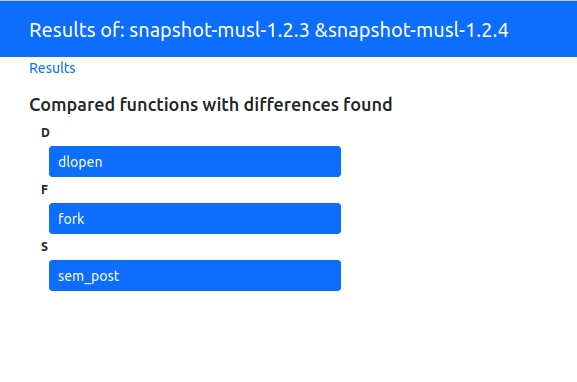

# Comparing library

In this example, we will demonstrate how to use DiffKemp on more complex
programs like libraries. This can be useful for checking if some
changes/refactoring in a library's codebase didn't cause semantic differences
in the library API. We will use the [musl libc](https://musl.libc.org/) library
and we will learn how to:

- save the result of the comparison to a directory,
- get statistics about the comparison,
- interpret the content of the output directory and
- use the result viewer for visualisation of the differences.

## 1. Getting the source files

We will compare two versions of the library, the chosen versions are `1.2.3`
and `1.2.4` but you can try different versions or even different libraries.
First, we need to get the source files, we can get them from
[here](https://musl.libc.org/releases.html) or we can download and extract
them with the following commands:

```sh
wget -qO- https://musl.libc.org/releases/musl-1.2.3.tar.gz | tar xz
wget -qO- https://musl.libc.org/releases/musl-1.2.4.tar.gz | tar xz
```

After downloading them and extracting them from the archive we need to
configure them. We can do this with the following commands:

```sh
(cd musl-1.2.3/ && ./configure)
(cd musl-1.2.4/ && ./configure)
```

## 2. Creating snapshots

Similar to [the simple program example](simple_program.md), we first need to
create snapshots of the program versions. We will save the snapshots as
`snapshot-musl-1.2.3` and `snapshot-musl-1.2.4`. We could make the snapshots
with the following command:

```sh
diffkemp build musl-1.2.3 snapshot-musl-1.2.3
diffkemp build musl-1.2.4 snapshot-musl-1.2.4
```

Because the `compare` command by default compares all functions, there would be
a lot of functions. We can change this by specifying a list of functions
which should be analyzed. This can be useful if you want to try it on your
library which has API functions for which you want to check if the semantic did
not change without checking all functions.

We can specify the functions by creating a file with the function
names (each name on a single line). Let's name the file `function_list`. It
could look for example like this:

```txt
sin
cos
open
sem_post
dlopen
fork
```

Then to build the snapshots we will provide the command with the location of the
file:

```sh
diffkemp build musl-1.2.3 snapshot-musl-1.2.3 function_list
diffkemp build musl-1.2.4 snapshot-musl-1.2.4 function_list
```

Building of the snapshots will take some time.

## 3. Comparing two versions of the library

After creating the snapshots, we can compare them. Because there are many
functions, using the `--stdout` argument (printing the result to standard
output) isn't the best idea. We can use the `-o` option followed by the
directory name to which the result will be saved. We can also add
`--report-stat` option to get basic statistics about the comparison.

```sh
diffkemp compare snapshot-musl-1.2.3 snapshot-musl-1.2.4 -o diff-musl --report-stat
```

If the `function_list` was used when building the snapshots then the
`diff-musl` directory should contain following files:

```txt
diffkemp-out.yaml
dlopen.diff
fork.diff
sem_post.diff
```

If there are no differences found then the directory is not even created.

## 4. Going through the comparison statistics

By using the `--report-stat` option, we will get the following text on standard
output:

```txt
Statistics
----------
Total symbols: 6
Equal:         3 (50%)
Not equal:     3 (50%)
(empty diff):  0 (0%)
Unknown:       0 (0%)
Errors:        0 (0%)
```

The report tells us that 6 symbols (functions) were compared. Three were
evaluated as equal and three were found to have differences. The `empty diff`
field reports for how many not-equal symbols were found differences in functions
with no syntax difference. The `Unknown` field represents how many symbols
DiffKemp could not evaluate (caused mainly by the symbol occurrence only in
one version of the program). The `Error` field represents symbols for which the
comparison failed.

> [!TIP]
> In reality, DiffKemp compared more than 6 functions, because it compares also
> the called functions. We could use `--extended-stat` option to get the total
> number of compared functions and other information (number of compared
> instructions, the total number of found differences, etc.).

## 5. Going through the results

In the output directory (`diff-musl`), there are multiple files. The files with
extension `.diff`
represents compared functions in which differences were found. So in our case,
if we compared `sin`, `cos`, `open`, `sem_post`, `dlopen` and `fork`
functions, we can see that the `dlopen`, `fork` and `sem_post` functions
contain semantic differences according to DiffKemp. The files contain more
details about the differences, let's look e.g., in the `dlopen.diff` file:

```txt
Found differences in functions called by dlopen

DYN_CNT differs:
  Callstack (snapshot-musl-1.2.3):
  load_library at ldso/dynlink.c:2089
  decode_dyn at ldso/dynlink.c:1127
  DYN_CNT (macro) at ldso/dynlink.c:915

  Callstack (snapshot-musl-1.2.4):
  load_library at ldso/dynlink.c:2163
  decode_dyn at ldso/dynlink.c:1189
  DYN_CNT (macro) at ldso/dynlink.c:977

  Diff:
    32
  
    37

decode_vec differs:
  Callstack (snapshot-musl-1.2.3):
  load_library at ldso/dynlink.c:2089
  decode_dyn at ldso/dynlink.c:1127
  decode_vec at ldso/dynlink.c:915

  Callstack (snapshot-musl-1.2.4):
  load_library at ldso/dynlink.c:2163
  decode_dyn at ldso/dynlink.c:1189
  decode_vec at ldso/dynlink.c:977

  Diff:
  *************** static void decode_vec(size_t *v, size_t *a, size_t cnt)
  *** 210,212 ***
      for (; v[0]; v+=2) if (v[0]-1<cnt-1) {
  !     a[0] |= 1UL<<v[0];
        a[v[0]] = v[1];
  --- 218,221 ---
      for (; v[0]; v+=2) if (v[0]-1<cnt-1) {
  !     if (v[0] < 8*sizeof(long))
  !       a[0] |= 1UL<<v[0];
        a[v[0]] = v[1];

dlopen differs:
  Diff:

fixup_rpath differs:
  Callstack (snapshot-musl-1.2.3):
  load_library at ldso/dynlink.c:2089
  fixup_rpath at ldso/dynlink.c:1057

  Callstack (snapshot-musl-1.2.4):
  load_library at ldso/dynlink.c:2163
  fixup_rpath at ldso/dynlink.c:1119

  Diff:
  *************** static int fixup_rpath(struct dso *p, char *buf, size_t buf_size)
  *** 868,870 ***
        case EACCES:
  !       break;
        default:
  --- 930,932 ---
        case EACCES:
  !       return 0;
        default:

map_library differs:
  Callstack (snapshot-musl-1.2.3):
  load_library at ldso/dynlink.c:2089
  map_library at ldso/dynlink.c:1119

  Callstack (snapshot-musl-1.2.4):
  load_library at ldso/dynlink.c:2163
  map_library at ldso/dynlink.c:1181

  Diff:

```

The file has a similar structure which we could see when we printed the result
to standard output in the [simple program example](simple_program.md#comparing-the-program-and-interpreting-the-result).
We can see, that for the `dlopen` function there were found multiple places with
probable semantic differences. They were found in macro `DYN_CNT`, functions
`decode_vec`, `dlopen`, `fixup_rpath` and `map_library`. For individual
differences we can see the call stacks and syntax differences
(if there are some). These items are more described in [the simple program
example](simple_program.md#comparing-the-program-and-interpreting-the-result).
The other `.diff` files have the same structure but of course, different
differences are found.

Except for the `.diff` files, there is also `diffkemp-out.yaml` file which
contains the same data but in a more structured form. It also contains some
metadata. This file can be used e.g. for automatic processing of the results.

## 6. Different visualizations of the differences

Because viewing the differences in the files can be kind of inconvenient, we
can use `diffkemp view` command to visualize the results in another way,
to do this we use the following command:

```sh
diffkemp view diff-musl
```

The command will launch a web application that we can access in our browser
on [http://localhost:3000](http://localhost:3000) url.
It will show us a list of the compared functions which were evaluated
to contain semantic differences, these are the same functions which are located
in the `diff-musl` directory as `*.diff` files.



By clicking on a specific function, we will see where the differences were
found:


By clicking on the differing function we will get the code of the function
in which was the difference found with the highlighted syntax difference.


There is also visible the call stack. By clicking on a function in the call
stack it will show us the code of the function and highlight the line where
the next function is called. This could help us if we wanted to manually
evaluate the correctness of DiffKemp evaluation.

Eg. by clicking on the first/compared function we will see this:


## 7. Summary

That's all for the example of library comparison. We learned, that:

- A list of functions, which should be compared if they are semantically
  the same or not, can be specified in the `diffkemp build` command.
- The `-o` option can be used in `diffkemp compare` command to specify
  a directory where the result (found differences) should be saved.
- The `--report-stat` option can be used to get statistics about the comparison.
- The output directory will contain `*.diff` files with the information about
  the differences.
- `diffkemp view` command can be used for a different visualization of the
  results.
